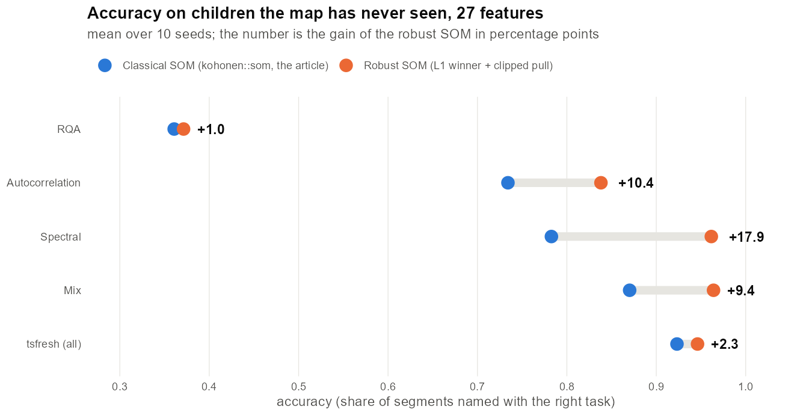
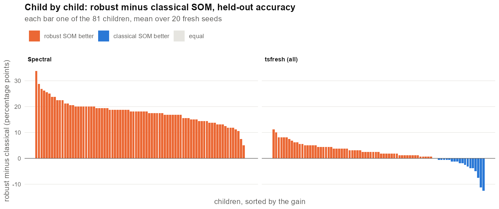
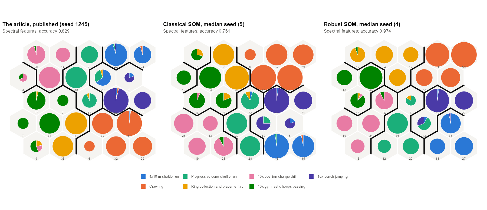
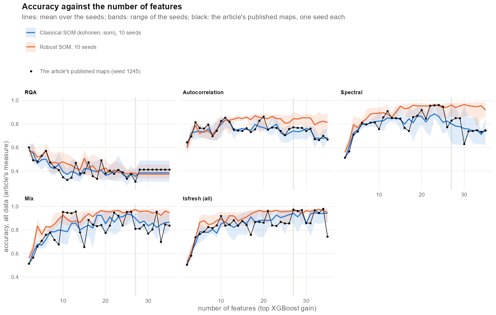
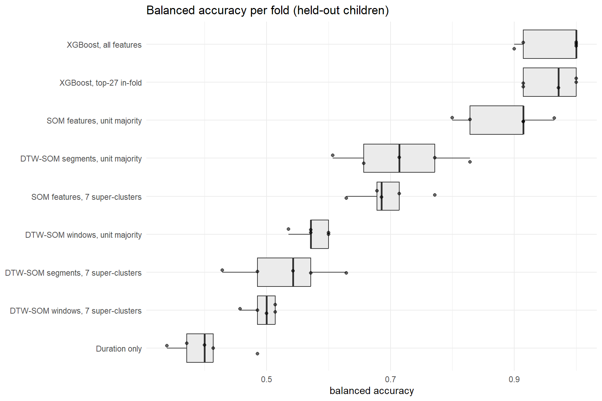
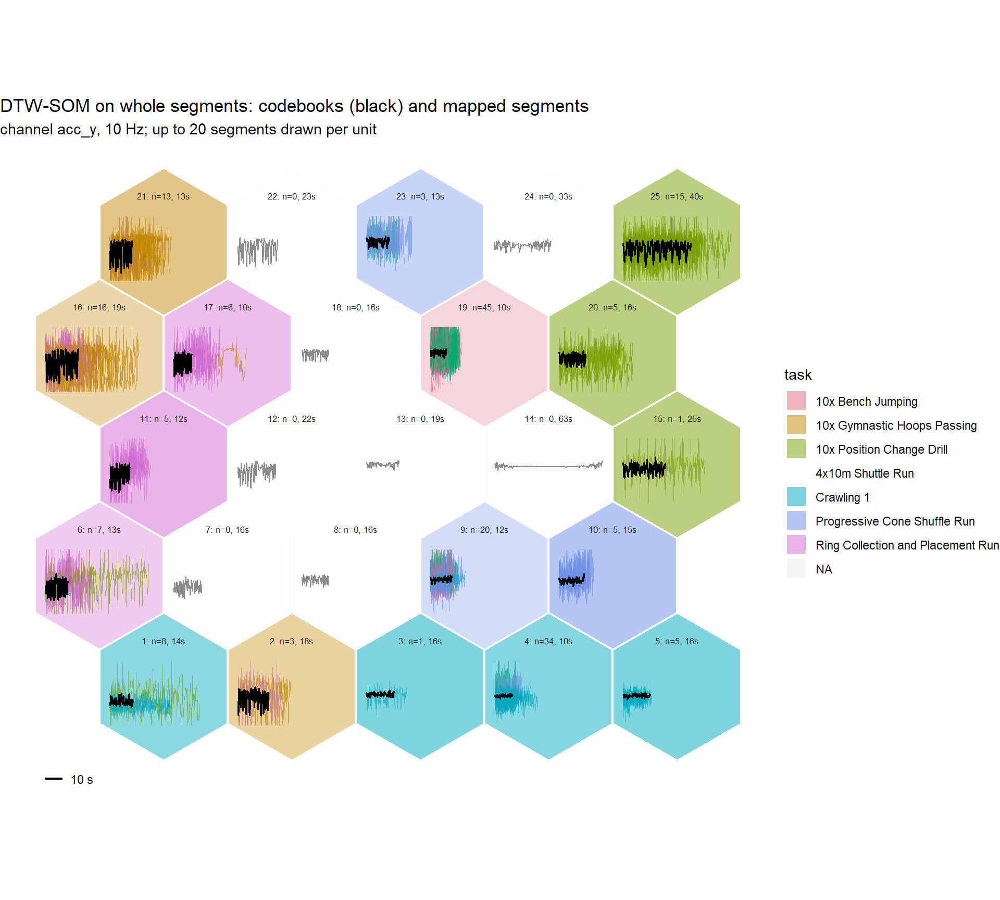
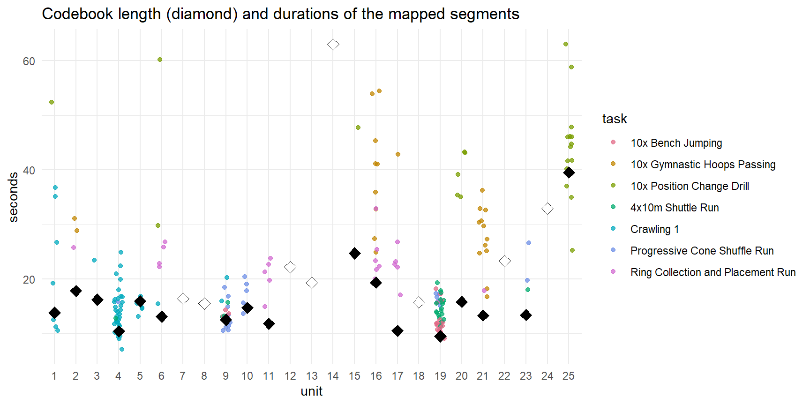
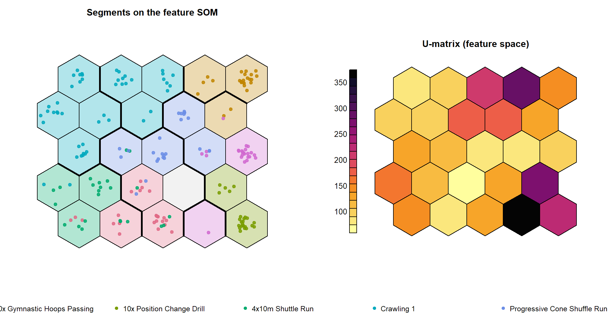

# movement_classification_v2026

Recognising children's movement tasks from a back-mounted IMU: a more accurate Self-Organizing Map for the
pipeline of

> Patrikei, A., Cuberek, R., Halfar, R., & Martinovič, T. (2026). Essential time series characteristics
> for human motion analysis based on Self-Organizing Map clustering. *Acta Gymnica, 56*, e2026.004.
> https://doi.org/10.5507/ag.2026.004

and alternatives to that pipeline, every model judged on children it has never seen.

| Report | What it shows |
|---|---|
| [`som_variants.Rmd`](som_variants.Rmd), **[interactive report](https://andrii-patrikei.github.io/movement_classification_v2026/)** | the article's features and pipeline with a **robust SOM**: 8.2 points more accurate on children the map has never seen |
| [`movement_alternatives.Rmd`](movement_alternatives.Rmd) | DTW-SOM, RQA + catch22, MiniRocket and Mantis next to the article's approach |
| [`supersom.Rmd`](supersom.Rmd), **[interactive report](https://andrii-patrikei.github.io/movement_classification_v2026/supersom.html)** | layered (SuperSOM), growing and DTW maps: no more accurate than the best single map, but they recognise children whose gyroscope failed |

## A robust SOM for the article's pipeline

The article clustered 648 movement segments (81 children, seven tasks, crawling recorded twice) with a classical
Kohonen SOM. `som_variants.Rmd` keeps everything else of the article (its feature matrices, read from its saved
models; the 5 x 5 map; the 7 PAM super-clusters; its accuracy and quality measures) and replaces only the map
with a **robust SOM** from [novel_SOM](https://github.com/andrii-patrikei/novel_SOM): the winning unit is chosen
by the Manhattan distance and every update step is clipped at one standard deviation, on exactly the article's
training schedule. The article's measures are reproduced to the last digit from its 170 saved maps, and its
published map retrains bit for bit.

**Accuracy with 27 features**, mean over seeds (children the map has never seen: 9 folds of 9 children, 10 seeds;
all 648 segments, the article's measure: 20 seeds)

| Feature set | Held-out children: classical SOM | robust SOM | gain (points) | All 648 segments: classical SOM | robust SOM | gain (points) |
|:--|--:|--:|--:|--:|--:|--:|
| RQA | 0.361 | 0.371 | **+1.0** | 0.365 | 0.381 | +1.6 |
| Autocorrelation | 0.734 | 0.838 | **+10.4** | 0.740 | 0.839 | +10.0 |
| Spectral | 0.783 | 0.962 | **+17.9** | 0.795 | 0.967 | +17.2 |
| Mix | 0.870 | 0.964 | **+9.4** | 0.891 | 0.961 | +7.0 |
| tsfresh (all) | 0.923 | 0.946 | **+2.3** | 0.940 | 0.957 | +1.7 |
| **Mean of the five** | 0.734 | 0.816 | **+8.2** | 0.746 | 0.821 | +7.5 |

- **Better beyond the seed noise on four of the five feature sets** for children the map has never seen (95%
  intervals over seeds exclude zero), level on RQA.
- **Confirmed child by child on 20 fresh seeds:** on the spectral features 80 of the 81 children are recognised
  better and none worse; on autocorrelation 76 better and 4 worse, on Mix 78 and 3, on tsfresh 61 and 18 (paired
  Wilcoxon signed-rank tests, Holm-adjusted p < 0.0001).
- **Why:** the features are heavy-tailed, and an L1 winner with a clipped pull keeps outlying segments from
  dragging prototypes. Clipping the features at 3 standard deviations helps the classical SOM too (0.803), but
  not as far as the robust SOM goes without it (0.816).
- **Seed-to-seed spread:** our published 0.974 (tsfresh) is a single seed near the top of its spread;
  20 seeds of the same `kohonen::som` call give 0.940 on average, from 0.853 to 0.975.
- **The screening behind the choice:** all 17 novel_SOM variants, each on novel_SOM's own schedule and on the
  article's (34 maps). On its own schedule novel_SOM gains little; the elastic distances (DTW, soft-DTW,
  shape-based) do not suit feature vectors, which have no time axis.



**Child by child** on fresh seeds: each bar is one of the 81 children, orange where the robust SOM recognises
the child's tasks better



**The maps**, the article's Fig. 3 on the spectral features: the robust SOM gives almost every task its own
super-cluster



**Number of features:** the robust SOM stays ahead across most of the range; the article's single-seed curve
(black) moves within the classical SOM's seed range



All numbers of the latest run: [figures/som_variants_table.md](figures/som_variants_table.md). The interactive
report (hover, switch feature sets and measures, sortable tables) is `docs/som_variants.html`.

**Run.** `Rscript run_som_variants.R` trains every map (about 1.5 hours on 18 cores) into `results/`; the results
of the latest run are committed, so knitting `som_variants.Rmd` takes a few minutes (`quick: true` in the YAML
header knits a small version from scratch). The article's saved models (95 MB) are downloaded into `data/` from
its repository on first use and checked by md5.

```r
install.packages(c("Rcpp", "kohonen", "aweSOM", "cluster", "data.table", "ggplot2", "plotly", "DT", "digest", "patchwork"))
```

Needs a C++17 compiler (Rtools on Windows). `novel_som/` holds `ns_core.cpp` and `ns_maps.R` from novel_SOM
(commit 2ae89c5) with one addition: an optional bubble neighbourhood, the one kohonen uses.

## Layered maps (SuperSOM)

`supersom.Rmd` tests whether one map trained on several layers at once (`kohonen::supersom`: the article's four
feature sets, plus three curves from the raw signal compared with DTW), growing or fixed, with fixed, learned or
chosen layer weights, beats the best single map. The core (`supersom/ss_core.cpp`) reproduces `kohonen::som` and
`kohonen::supersom` bit for bit; 28 maps, 10 seeds, children held out, the winner confirmed on 20 fresh seeds.

- **Not more accurate:** the best layered map (layers chosen on the training children) reaches 0.941 on held-out
  children under the article's rule against 0.963 for the robust SOM on Mix, and stays just below the spectral map when
  each unit names its task (0.976 against 0.979; lower on 16 of 20 fresh seeds). The four feature sets as equal layers
  fall to 0.83: the weak RQA layer blurs the 7 super-clusters, although the units stay nearly as pure.
- **Useful when a sensor is missing:** trained on all seven layers and fed only the accelerometer curves, the map
  recognises the 9 children the article dropped (their gyroscope failed) at 0.867, against 0.767 for the best map
  trained on the accelerometer alone (better on 10 of 10 seeds; these children were in no step of the feature selection).
- **Growing adds no accuracy, and DTW lowers the layered maps** (it helps a single posture-curve map). Literature check:
  a growing layered map is published in kernel form (a growing multiple-kernel GSOM, Wijewardena et al. 2015); in
  kohonen's form, with DTW and Manhattan layers and medoid births, it was not found. Learned layer weights, DTW layers
  (the `sits` package) and growth with DTW (GSOM Sequence, 2011) are published.

`Rscript run_supersom.R` trains every map (about 2 hours on 17 cores) into `supersom/results/`; then knit
`supersom.Rmd` (a few minutes). `Rscript supersom/tests/test_core.R` checks the core against kohonen.

## Alternatives to the pipeline

`movement_alternatives.Rmd` re-runs the article's approach on the same open data under a child-grouped
cross-validation protocol, next to:

- DTW-SOM on raw 4 s windows and on whole segments of different lengths ([dtwsom](https://github.com/andrii-patrikei/dtwsom))
- RQA features with a recurrence-rate threshold ([chaos-rcpp](https://github.com/andrii-patrikei/chaos-rcpp)) plus catch22, with XGBoost and a kohonen SOM
- MiniRocket + ridge classifier ([aeon](https://www.aeon-toolkit.org))
- Mantis, a pretrained time-series foundation model: frozen embeddings + random forest (optional)

Every model is evaluated on children it has not seen. The document also draws the SOM maps:
DTW-SOM codebooks of different lengths with the segments mapped to them, and the feature SOM.

Figures from a knit on the Zenodo data; every real-data run regenerates them in `figures/`.
The numbers of the latest run: [figures/results_table.md](figures/results_table.md).

**Balanced accuracy on held-out children**, per method and fold



**DTW-SOM on whole segments.** Each hexagon is a unit: its codebook in black, the segments mapped
to it coloured by task, all on one time scale, so codebooks of different lengths are visible directly.



**Codebook length** (diamond) next to the durations of the segments mapped to each unit



**Feature SOM**, the article's view: segments coloured by task, the 7 super-clusters, and the U-matrix



**Run.** Open `movement_alternatives.Rmd` in RStudio and knit. Parameters are in the YAML header:

1. `synthetic: true`: fake recordings in the same layout, tests the whole pipeline in about a minute
2. `synthetic: false`, `quick: true`: real data, 24 children, 5 folds
3. `quick: false`, `k_folds: 9`, `repeats: 5`: the full protocol

```r
install.packages(c("data.table", "xgboost", "kohonen", "nnet", "ggplot2", "MASS",
                   "Rcatch22", "reticulate", "remotes"))
remotes::install_github("andrii-patrikei/chaos-rcpp")
remotes::install_github("andrii-patrikei/dtwsom")
```

For MiniRocket and Mantis, in the Python that reticulate uses (or set `python:` in the YAML header):

```
pip install aeon scikit-learn
pip install mantis-tsfm torch     # optional, Mantis
```

## Data

81 children, seven movement tasks (crawling performed twice), back-mounted Axivity AX6 IMU at 100 Hz:
Cuberek, R., et al. (2024). *Physical exercise measurements with accelerometer and gyroscope* (Version 2, 2026)
[Data set]. Zenodo. https://doi.org/10.5281/zenodo.10984137

`movement_alternatives.Rmd` downloads the CSV (191 MB) into `data/`, which is not tracked by git;
`som_variants.Rmd` downloads the article's saved models there.

## Original code

The code behind the article: https://code.it4i.cz/ADAS/movement-classification (IT4Innovations).
This repository is an independent reimplementation.

## Acknowledgements

Thanks to my co-authors R. Cuberek, R. Halfar and T. Martinovič, and to the IT4Innovations National
Supercomputing Center, where the original study was done.

## License

MIT
